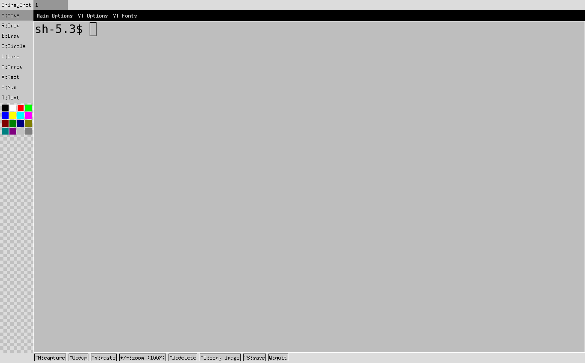

<p align="center">
  
</p>

# ShineyShot

ShineyShot brings capture and annotation tools together across four complementary modes so workflows can move from a quick markup to a fully scripted pipeline without switching apps. Updated screencaps for every workflow will land soon.

## Installation

### Prerequisites

ShineyShot relies on CGO-backed bindings for GLFW and `golang.org/x/mobile`. Install the system packages before compiling:

- **Linux (Debian/Ubuntu):** `sudo apt-get install build-essential pkg-config libgl1-mesa-dev xorg-dev libwayland-dev libxkbcommon-dev`.
- **Linux (Fedora):** `sudo dnf install @development-tools pkgconfig mesa-libGL-devel libX11-devel libXrandr-devel wayland-devel libxkbcommon-devel`.
- **macOS:** Ensure the Xcode Command Line Tools are installed (`xcode-select --install`) and install GLFW via Homebrew (`brew install glfw`).

### Prebuilt releases

Download signed artifacts for Linux from the [latest GitHub release](https://github.com/arran4/shineyshot/releases/latest). GoReleaser publishes:

- `.tar.gz` archives for `linux` on `amd64`, `386`, `arm64`, and ARMv6/v7.
- Native packages in `.deb`, `.rpm`, `.apk`, and Arch Linux (`.pkg.tar.zst`) formats.

Install the package format that matches your distribution, or extract the archive and place the `shineyshot` binary somewhere on your `PATH`.

### Build and install

Clone the repository or update to the desired revision, then run the following commands from the project root:

```bash
go mod download
go build ./cmd/shineyshot
go install ./cmd/shineyshot
```

The final command places the compiled binary in `$(go env GOBIN)` (or `$(go env GOPATH)/bin` when `GOBIN` is unset) so it is available on your `PATH`.

## UI Mode

Launch the graphical editor from any environment and control how it starts up with command-line flags.

```bash
# Open the editor directly on an existing image
shineyshot annotate -file snapshot.png open

# Paste from the clipboard directly into the editor
shineyshot annotate -from-clipboard open

# Capture the active window (or specify a selector) and jump straight into annotation
shineyshot annotate --shadow --shadow-radius 40 capture window "Settings Panel"

# Start in capture region mode with a preset rectangle
shineyshot annotate capture region 0,0,1440,900
```

When the compositor supports it, combine `annotate capture` with `--include-decorations` to keep window frames or `--include-cursor` to embed the pointer directly in the image.

### Drop shadows

When you want a subtle frame around a screenshot, consider enabling the drop-shadow flags. `-shadow` turns the effect on for the command while `-shadow-radius`, `-shadow-offset`, and `-shadow-opacity` let you tune the blur, offset, and transparency to your liking. The same defaults carry into the editor so subsequent captures and pasted images can reuse them.

Inside the UI you can tap the `$` toolbar button—or press `$` on the keyboard—to apply the configured shadow once per tab. The control politely steps aside after it runs so you do not accidentally stack multiple shadows on the same image.

### Screenshot



## Modes at a Glance

- **UI mode** keeps the graphical editor front and centre for drag-and-drop annotation, layering, and exporting.
- **CLI file mode** automates repeatable capture and markup tasks without leaving the terminal.
- **CLI background mode** keeps a session alive so other commands—or other people—can reuse the same permissions.
- **Interactive mode** gives you a text-driven shell with history and inline help.

## Snapshot command

Fire off a one-off screenshot without starting the editor. The `snapshot` subcommand exposes flags that mirror the capture paths inside the other modes so you can experiment from the terminal:

```bash
# Save the full desktop from display 0 into screenshot.png
shineyshot snapshot -mode screen -display 0 -output screenshot.png

# Target a specific window by substring match and keep the PNG on disk
shineyshot snapshot -mode window -window "Settings" -output window.png

# Pipe a capture directly to another process without touching the filesystem
shineyshot snapshot -mode screen -stdout | file -

# Capture a preset region in global coordinates
shineyshot snapshot -mode region -region 0,0,1280,720 -output region.png

# Launch the interactive region picker provided by the portal
shineyshot snapshot -mode region -output picked.png
```

When `-region` is omitted the command falls back to the same interactive selection dialog used elsewhere in ShineyShot, matching the conditional branch in [`cmd/shineyshot/snapshot.go`](cmd/shineyshot/snapshot.go).

## CLI File Mode

Group repeated operations on a file behind the `file` subcommand. The file path is supplied once and passed to nested commands unless you override it.

Behind the scenes the wrapper injects `-output` for `snapshot` and `-file`/`-output` for `draw`, `annotate`, and `preview` before handing control to the nested command. Provide replacement values alongside the nested command if you need a different destination—the extra flags you supply take precedence over the defaults that `file` adds.

```bash
sh-5.3$ shineyshot file -file snapshot.png capture screen
saved /home/user/Pictures/snapshot.png
sh-5.3$ shineyshot file -file snapshot.png draw line 10 10 200 120
saved /home/user/Pictures/snapshot.png
sh-5.3$ shineyshot file -file snapshot.png preview
```

Nested commands can still set `-file` or `-output` to redirect work elsewhere:

```bash
sh-5.3$ shineyshot file -file snapshot.png draw -output annotated.png arrow 0 0 320 240
saved /home/user/Pictures/annotated.png

# Read from the clipboard, draw markup, and keep the result in the clipboard
sh-5.3$ shineyshot file -file clip.png -from-clipboard draw -to-clipboard rect 40 40 480 320
copied annotated clip.png to clipboard
```

### Capture screenshots on Linux

ShineyShot talks to the desktop portal and prints Linux-friendly status messages describing where the image is saved. Pick from three capture modes:

```bash
# Capture the entire display (default)
sh-5.3$ shineyshot file -file screenshot.png capture screen 0
saved /home/user/Pictures/screenshot.png

# Capture the current active window (pass a selector to target another)
sh-5.3$ shineyshot file -file screenshot.png capture window firefox

# Capture a specific rectangle (x0,y0,x1,y1)
sh-5.3$ shineyshot file -file screenshot.png capture region 0,0,640,480
```

Provide an optional selector argument—or `-select` for scripts—to target a specific display or window.
Window captures fall back to the active window when no selector is provided. Supply regions with the `-rect` flag or trailing `x0,y0,x1,y1` coordinates.

Pass `--stdout` to write the PNG bytes to stdout instead of creating a file. Add `--to-clipboard` when you want to skip disk altogether and push the capture straight into the clipboard for pasting elsewhere.

When the compositor supports it, use `-include-decorations` to request window frames and `-include-cursor` to embed the pointer into the screenshot. Interactive mode accepts the same flags so you can keep the preference while exploring the shell.

`snapshot` captures also honour the drop-shadow flags discussed above so you can add framing immediately:

```bash
sh-5.3$ shineyshot snapshot --shadow --shadow-offset 24,24 capture window firefox
```

### Draw quick markup

Apply lightweight annotations to an existing image. Lines and arrows expand the canvas as needed so their endpoints stay visible. Every draw command supports clipboard input/output so you can stay entirely in-memory:

```bash
sh-5.3$ shineyshot draw -from-clipboard -output bug.png rect 10 10 320 200
sh-5.3$ shineyshot draw -file bug.png -to-clipboard text 60 120 "Needs padding"
```

Shapes accept the following coordinate formats. Each row pairs the argument list with a complete command you can paste into a script or terminal session:

| Shape  | Arguments         | Example command |
| ------ | ----------------- | --------------- |
| line   | `x0 y0 x1 y1`     | `shineyshot file -file input.png draw line 10 10 200 120` |
| arrow  | `x0 y0 x1 y1`     | `shineyshot file -file input.png draw -color green arrow 10 10 200 160` |
| rect   | `x0 y0 x1 y1`     | `shineyshot file -file input.png draw rect 10 10 220 160` |
| circle | `cx cy radius`    | `shineyshot file -file input.png draw circle 120 120 30` |
| number | `x y value`       | `shineyshot file -file input.png draw number 40 80 1` |
| text   | `x y "string"`   | `shineyshot file -file input.png draw text 60 120 "Review"` |
| mask   | `x0 y0 x1 y1`     | `shineyshot file -file input.png draw -mask-opacity 128 mask 20 20 180 140` |

### CLI automation example

Bundle capture and annotation into a single script when building CI jobs or local helpers:

```bash
#!/usr/bin/env bash
set -euo pipefail

output_dir="${1:-./runs}"
mkdir -p "$output_dir"

target="$output_dir/$(date +%F)-dashboard.png"

shineyshot file -file "$target" capture window goland
shineyshot file -file "$target" draw text 40 60 "Build: ${CI_PIPELINE_ID:-local}"
shineyshot file -file "$target" draw arrow 120 120 320 180
```

## CLI Background Mode

Run ShineyShot as a background service and communicate via UNIX sockets. The daemon runs within the current user session so scripts can reuse capture permissions without additional prompts.

```bash
# Start a named background session (socket stored in $XDG_RUNTIME_DIR/shineyshot or ~/.shineyshot/sockets) [Socket directory](#socket-directory) for `--dir` overrides)
sh-5.3$ shineyshot background start demo-session
started background session demo-session at /run/user/1000/shineyshot/demo-session.sock

# List all active sessions
sh-5.3$ shineyshot background list
available sockets:
  demo-session

# Attach to a running session for live interaction
sh-5.3$ shineyshot background attach demo-session
> arrow 0 0 320 240
no image loaded
> ^D

# Run a single command within the session
sh-5.3$ shineyshot background run demo-session capture screen
captured screen current display
sh-5.3$ shineyshot background attach demo-session
> arrow 0 0 320 240
arrow drawn
> ^D

# Stop the session with the stop command when finished
sh-5.3$ shineyshot background stop demo-session
stop requested for demo-session
```

Store helpers alongside other dotfiles utilities; for example, `~/.local/bin/shineyshot-window` can wrap `shineyshot background run MySession capture window "$1"` so scripts capture consistent evidence before processing.

### Socket directory

All background subcommands accept `--dir` to control where sockets live. When omitted, ShineyShot first checks `SHINEYSHOT_SOCKET_DIR`, then falls back to `$XDG_RUNTIME_DIR/shineyshot` on Unix-like systems, and finally `~/.shineyshot/sockets`. Point `--dir` at a project workspace or systemd runtime directory when the default discovery rules do not match your environment.

## Interactive Mode

Use the text-driven shell for command discovery, history, and inline execution:

```bash
sh-5.3$ shineyshot interactive
Interactive mode. Type 'help' for commands.
> help
Commands:
  capture screen [DISPLAY]   capture full screen; use 'screens' to list displays
  capture window [SELECTOR]   capture window by selector; defaults to active window; 'windows' lists options
  capture region SCREEN X Y WIDTH HEIGHT   capture region on a screen; 'screens' lists displays
  arrow x0 y0 x1 y1          draw arrow with current stroke
  line x0 y0 x1 y1           draw line with current stroke
  rect x0 y0 x1 y1           draw rectangle with current stroke
  circle x y r               draw circle with current stroke
  crop x0 y0 x1 y1           crop image to rectangle
  color [value|list]         set or list palette colors
  colors                     list palette colors
  width [value|list]         set or list stroke widths
  widths                     list stroke widths
  show                       open synced annotation window
  preview                    open copy in separate window
  save FILE                  save image to FILE
  savetmp                    save to /tmp with a unique filename
  savepictures               save to your Pictures directory (defaults to ~/Pictures)
  savehome                   save to your home directory
  copy                       copy image to clipboard
  windows                    list available windows and selectors
  screens                    list available screens/displays
  copyname                   copy last saved filename
  background start [NAME] [DIR]   launch a background socket session
  background stop [NAME] [DIR]    stop a background socket session
  background list [DIR]           list background sessions
  background clean [DIR]          remove dead background sockets
  background run [NAME] COMMAND [ARGS...]   run a socket command (e.g., 'background run capture screen')
  quit                       exit interactive mode

Window selectors:
  index:<n>        window list index (see 'windows')
  id:<hex|dec>     X11 window id
  pid:<pid>        process id that owns the window
  exec:<name>      executable name substring
  class:<name>     X11 WM_CLASS substring
  title:<text>     window title substring (useful for literal words like 'list')
  <text>           fallback substring match on title/executable/class
```

From inside the shell, run commands such as `capture window` or `draw rect 10 10 200 180`. You can also pre-seed commands when launching:

```bash
sh-5.3$ shineyshot interactive -e "capture screen" -e "rect 10 10 200 200"
captured screen current display
rectangle drawn
```

Launch the shell with `--include-decorations`, `--include-cursor`, and notification flags (for example, `--notify-copy`) to keep those preferences active for every capture command in the session.

## Global flags and configuration

Enable desktop notifications at launch when you want audible or visual confirmation that an operation finished successfully:

```bash
# Announce captures, saves, and clipboard copies
shineyshot --notify-capture --notify-save --notify-copy snapshot capture window "Release Notes"
```

Notification text and titles can be customised with environment variables:

- `SHINEYSHOT_NOTIFY_TITLE` – overrides the notification title.
- `SHINEYSHOT_NOTIFY_CAPTURE_TEXT` – template for capture alerts (receives the capture detail).
- `SHINEYSHOT_NOTIFY_SAVE_TEXT` – template for save alerts (receives the saved path).
- `SHINEYSHOT_NOTIFY_COPY_TEXT` – template for clipboard alerts (receives a short description).

Background sockets default to `XDG_RUNTIME_DIR/shineyshot` on Linux or `~/.shineyshot/sockets` everywhere else. Set `SHINEYSHOT_SOCKET_DIR` (or pass `-dir`) to point the daemon and helpers somewhere specific.


## Testing

First-time runs may spend additional time downloading Go modules before executing. Once dependencies are cached, run all checks with:

```bash
go test ./...
```

## License

ShineyShot is licensed under the GNU Affero General Public License v3.0. See [LICENSE](LICENSE) for details.
